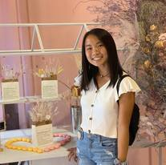
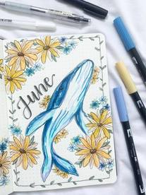
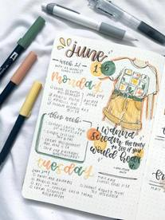
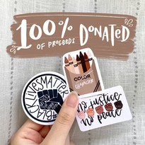

# About Me

Hi! My name is Clara. I'm a junior at East Brunswick High School in New Jersey. In my free time, I enjoy playing tennis, the guitar, piano, and drawing! I run an instagram for my bullet journal where I share my art and productivity/lifestyle tips, and recently I opened a small business - an etsy sticker shop!

# What I've Been Doing in Quarantine 
### Bullet Journaling:   
*I started an Instagram account (@journalsbyclara) where I share my art as well as productivity tips. My page can be found [here](https://www.instagram.com/journalsbyclara) Here is some of my work:* 
    
### Etsy Sticker Shop:  
*With my strong passion in digital art, I decided to use my skills and start a small business selling stickers on etsy. My shop, Bucket of Stickers, can be found at bucketofstickers.etsy.com. I recently listed a new item of 3 stickers with Black Lives Matter designs, where 100% of net proceeds will be donated to Campaign Zero, a platform aiming to find effective solutions to end police violence. So far, I have raised $400!!* 
 
### Other hobbies: 
*playing guitar, tennis, longboarding, and doing digital art*

# Brag Sheet
## Girls Varsity Tennis *(2017 - present)* 
 - 3rd singles (2018), 1st & 2nd doubles (2017, 2019) 
 
## Clarion School Newspaper *(2018 - present)* 
 - Assistant Editor in Chief (2020-2021) 
 - Entertainment Section Editor (2019-2020)
 
## FTC Robotics Team 11697 *(2018 - present)* 
 - Outreach/Communication Leader 
 - Engineering Notebook Leader 
 - Championship Winning Alliance at NJ State Championship (2019) & advanced to World Champtionship in Detroit, Michigan 
 
## Lions Club *(2017 - present)*  
 - President of Highland Park Leo Club 
 - Webmaster Co-Lead 
 - contributing to the community through volunteerism: beach cleans, veteran center performances, food banks, etc.
 - Event lead for Diabetic Care & Healthy Care Event at Robert Wood Johnson Hospital 
 - Annual White Cane Fundraising/Awareness Event Coordinator at Menlo Park Mall 
 
## EBTECS *(2018 - present)*  
 - providing assistance for those who need technology help 
 
## Key Club *(2019 - present)*  
 - Webmaster 
 - demonstrating leadership through volunteering 
 
## Model United Nations *(2017 - 2019)*  
 - Position Paper Award at Philadelphia MUN Conference 
 
## Honors Societies *(2019 - present)*  
 - Mu Alpha Theta Honors Society - Vice President
 - Science Honors Society
 - National Honors Society

